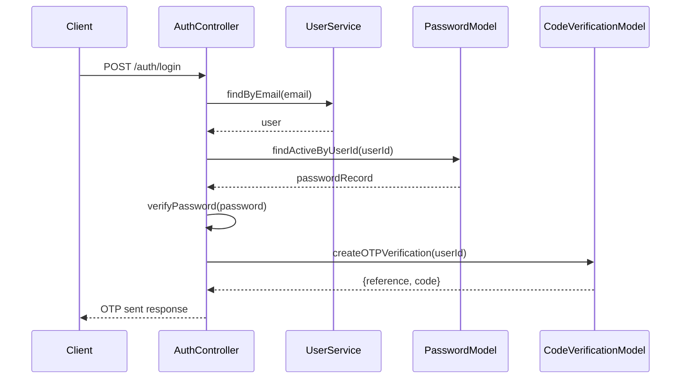
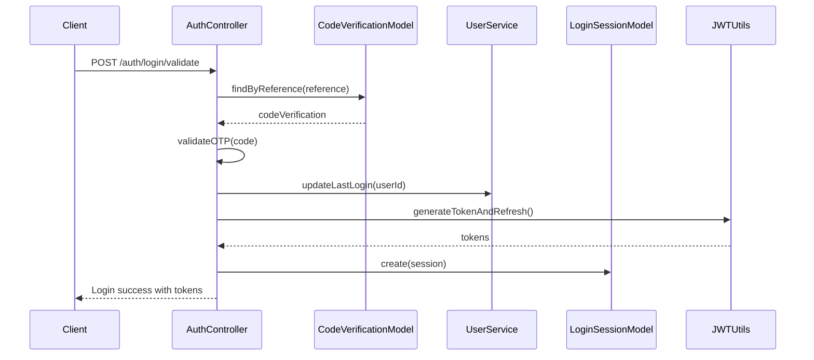
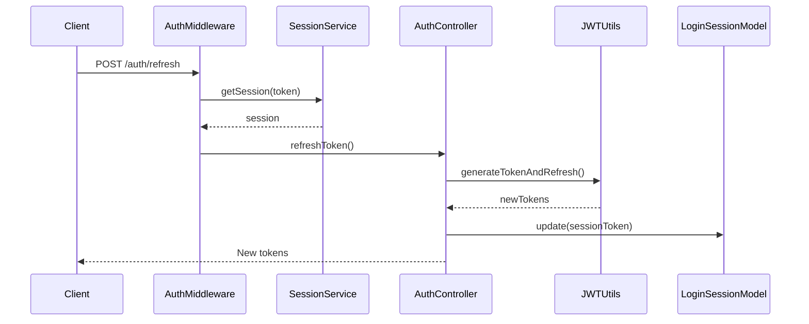

# 🔐 Authentication Boilerplate - Node.js TypeScript Backend

A comprehensive, production-ready authentication system built with Node.js, Express, TypeScript, and MongoDB. This boilerplate provides a complete authentication solution with advanced security features, role-based access control, and modular architecture that can be easily integrated into any project.

## 🚀 Features

### 🔒 Security Features
- **RSA-based JWT Authentication**: Uses RS256 algorithm with public/private key pairs for enhanced security
- **Multi-Factor Authentication (MFA)**: OTP-based verification system with configurable expiry
- **Account Lockout Protection**: Automatic account lockout after failed login attempts
- **Session Management**: Secure session tracking with IP and user agent validation
- **Password Encryption**: RSA encryption for password storage
- **Rate Limiting**: Built-in rate limiting to prevent brute force attacks
- **CORS Protection**: Configurable cross-origin resource sharing
- **Security Headers**: Helmet.js integration for security headers

### 👥 User Management
- **Role-Based Access Control (RBAC)**: Granular permission system with role and user-level permissions
- **User Status Management**: Active, Inactive, Suspended, and Banned statuses
- **Soft Delete**: Safe user deletion with data retention
- **Profile Management**: Complete user profile with avatar support
- **Email/Phone Verification**: Built-in verification system

### 🏗️ Architecture
- **Modular Design**: Clean separation of concerns with MVC pattern
- **TypeScript**: Full type safety and better development experience
- **Database Migrations**: Version-controlled database schema changes
- **Database Seeders**: Automated data seeding for development
- **Error Handling**: Comprehensive error handling with custom error classes
- **Logging**: Structured logging with Pino
- **Environment Configuration**: Flexible configuration management

## 📁 Project Structure

```
chatbot-backend/
├── src/
│   ├── app/
│   │   ├── http/
│   │   │   ├── controllers/
│   │   │   │   ├── auth/
│   │   │   │   │   └── auth.controller.ts      # Authentication logic
│   │   │   │   ├── user/
│   │   │   │   │   └── user.controller.ts      # User management
│   │   │   │   └── controller.ts               # Base controller
│   │   │   ├── middleware/
│   │   │   │   ├── auth.middleware.ts          # JWT authentication
│   │   │   │   ├── permission.middleware.ts    # RBAC middleware
│   │   │   │   ├── error.middleware.ts         # Error handling
│   │   │   │   └── not-found.middleware.ts     # 404 handling
│   │   │   └── services/
│   │   │       ├── user.service.ts             # User business logic
│   │   │       └── session.service.ts          # Session management
│   │   ├── models/
│   │   │   ├── base.model.ts                   # Base model class
│   │   │   ├── user.model.ts                   # User model
│   │   │   ├── role.model.ts                   # Role model
│   │   │   ├── password.model.ts               # Password model
│   │   │   ├── login-session.model.ts          # Session model
│   │   │   └── code-verification.model.ts      # OTP model
│   │   ├── providers/
│   │   │   ├── database.provider.ts            # Database connection
│   │   │   └── route.provider.ts               # Route registration
│   │   └── utils/
│   │       ├── jwt.ts                          # JWT utilities
│   │       ├── encryption.ts                   # RSA encryption
│   │       ├── permissions.ts                  # Permission utilities
│   │       ├── random.ts                       # Random generation
│   │       └── response.ts                     # Response formatting
│   ├── config/
│   │   ├── app.ts                              # Application config
│   │   └── logger.ts                           # Logger config
│   ├── database/
│   │   ├── migrations/                         # Database schemas
│   │   └── seeders/                            # Data seeding
│   └── routes/
│       └── api/
│           └── auth/
│               └── index.ts                    # Auth routes
├── storage/
│   └── keys/                                   # RSA keys
└── public/                                     # Static files
```

## 🔧 Core Modules Documentation

### 1. Authentication Module (`src/app/http/controllers/auth/`)

#### AuthController
The main authentication controller handling all auth-related operations:

**Key Methods:**
- `login()`: Initial login step with OTP generation
- `loginValidate()`: OTP validation and token generation
- `resendOTP()`: OTP resend functionality
- `logout()`: Session invalidation
- `me()`: Current user information
- `refreshToken()`: Token refresh

**Security Features:**
- Account lockout after 3 failed attempts
- 1-day lockout duration
- 10-minute OTP expiry
- Rate limiting on OTP resend

```typescript
// Example login flow
POST /api/v1/auth/login
{
  "email": "user@example.com",
  "password": "password123"
}

// Response
{
  "success": true,
  "message": "OTP sent successfully",
  "data": {
    "reference": "abc123...",
    "user": { "email": "user@example.com" }
  }
}
```

### 2. User Management Module (`src/app/http/services/user.service.ts`)

#### UserService
Comprehensive user management with CRUD operations:

**Features:**
- User creation with role assignment
- Password encryption using RSA
- Email/phone uniqueness validation
- Soft delete functionality
- Login attempt tracking
- Status management

**Key Methods:**
- `create()`: Create new user with encrypted password
- `update()`: Update user information
- `delete()`: Soft delete user
- `findByEmail()`: Find user by email
- `updateLastLogin()`: Track login activity
- `incrementLoginAttempts()`: Security tracking

### 3. Session Management (`src/app/models/login-session.model.ts`)

#### LoginSessionModel
Secure session tracking with multiple security layers:

**Features:**
- Session token validation
- IP address tracking
- User agent validation
- Automatic session cleanup
- Session deactivation

**Security Measures:**
- Session expiry after 30 days of inactivity
- Automatic cleanup of expired sessions
- IP and user agent validation

### 4. Role-Based Access Control (`src/app/utils/permissions.ts`)

#### Permission System
Granular permission system with role and user-level permissions:

**Permission Structure:**
```typescript
{
  users: {
    create: true,
    read: true,
    update: true,
    delete: false
  },
  roles: {
    create: false,
    read: true,
    update: false,
    delete: false
  }
}
```

**Available Middleware:**
- `requirePermission(resource, action)`: Check specific permission
- `requireAllPermissions(permissions)`: Check multiple permissions
- `requireAnyPermission(permissions)`: Check at least one permission
- `requireResourceAccess(resource)`: Check resource access

### 5. Database Models

#### User Model (`src/database/migrations/user.migration.ts`)
```typescript
interface UserDocument {
  firstName: string;
  lastName?: string;
  email: string;
  phone?: string;
  avatar?: string;
  mfa_enabled: boolean;
  loginAttempts: number;
  inactiveTill?: Date;
  roleId: Types.ObjectId;
  permissions?: Record<string, unknown>;
  status: UserStatus;
  deletedAt?: Date;
}
```

#### Role Model
```typescript
interface RoleDocument {
  name: string;
  slug: string;
  permissions: Permission;
  status: boolean;
}
```

#### Password Model
```typescript
interface PasswordDocument {
  userId: Types.ObjectId;
  password: string; // RSA encrypted
  status: boolean;
  expired: boolean;
  expiredAt: Date;
}
```

### 6. Security Utilities

#### JWT Utilities (`src/app/utils/jwt.ts`)
- RSA-based token signing (RS256)
- Access and refresh token generation
- Token verification with public key
- Configurable token expiry

#### Encryption Utilities (`src/app/utils/encryption.ts`)
- RSA password encryption
- Secure password verification
- Public/private key management

## 🔄 Authentication Flow

### 1. Login Process


### 2. OTP Validation


### 3. Token Refresh


## 🛡️ Security Implementation

### 1. Password Security
- **RSA Encryption**: Passwords encrypted using RSA public key
- **No Plain Text Storage**: Passwords never stored in plain text
- **Secure Verification**: Password verification using private key decryption

### 2. JWT Security
- **RS256 Algorithm**: Asymmetric signing for enhanced security
- **Short-lived Access Tokens**: 1-minute expiry for access tokens
- **Long-lived Refresh Tokens**: 72-hour expiry for refresh tokens
- **Token Rotation**: New tokens generated on refresh

### 3. Session Security
- **Session Tracking**: Each login creates a unique session
- **IP Validation**: Sessions tied to IP addresses
- **User Agent Validation**: Browser/device tracking
- **Automatic Cleanup**: Expired sessions automatically removed

### 4. Account Protection
- **Failed Login Tracking**: Counts failed attempts
- **Account Lockout**: Automatic lockout after 3 failed attempts
- **Lockout Duration**: 1-day lockout period
- **OTP Expiry**: 10-minute OTP validity

## 🚀 Getting Started

### Prerequisites
- Node.js (>=22.12.0)
- npm (>=9.0.0)
- MongoDB (>=4.4)

### Installation

1. **Clone the repository**
```bash
git clone https://github.com/globaldesignindia/chatbot-backend.git
cd chatbot-backend
```

2. **Install dependencies**
```bash
npm install
```

3. **Environment Setup**
```bash
cp env.example .env
```

4. **Generate RSA Keys**
```bash
# Create directories
mkdir -p storage/keys/api storage/keys/encryption

# Generate API keys (JWT signing)
ssh-keygen -t rsa -b 2048 -m PEM -f storage/keys/api/private.key
openssl rsa -in storage/keys/api/private.key -pubout -outform PEM -out storage/keys/api/public.key

# Generate encryption keys (Password encryption)
ssh-keygen -t rsa -b 2048 -m PEM -f storage/keys/encryption/private.key
openssl rsa -in storage/keys/encryption/private.key -pubout -outform PEM -out storage/keys/encryption/public.key
```

5. **Database Setup**
```bash
# Seed database with roles and default admin user
npm run seed
```

6. **Start Development Server**
```bash
npm run dev
```

### Default Admin Credentials
- **Email**: admin@example.com
- **Password**: admin123
- **Role**: Super Admin

⚠️ **Important**: Change the default password after first login!

## 📡 API Endpoints

### Authentication Endpoints

| Method | Endpoint | Description | Auth Required |
|--------|----------|-------------|---------------|
| POST | `/api/v1/auth/login` | Initiate login (send OTP) | No |
| POST | `/api/v1/auth/login/validate` | Validate OTP and login | No |
| POST | `/api/v1/auth/resend/otp` | Resend OTP | No |
| POST | `/api/v1/auth/logout` | Logout user | Yes |
| GET | `/api/v1/auth/me` | Get current user info | Yes |
| POST | `/api/v1/auth/refresh` | Refresh access token | Yes |

### Request/Response Examples

#### Login Request
```bash
POST /api/v1/auth/login
Content-Type: application/json

{
  "email": "user@example.com",
  "password": "password123"
}
```

#### Login Response
```json
{
  "success": true,
  "message": "OTP sent successfully",
  "data": {
    "reference": "abc123def456...",
    "user": {
      "email": "user@example.com"
    }
  }
}
```

#### OTP Validation Request
```bash
POST /api/v1/auth/login/validate
Content-Type: application/json

{
  "reference": "abc123def456...",
  "code": "123456"
}
```

#### OTP Validation Response
```json
{
  "success": true,
  "message": "Login successful",
  "data": {
    "user": {
      "id": "507f1f77bcf86cd799439011",
      "email": "user@example.com",
      "firstName": "John",
      "lastName": "Doe",
      "roleId": "507f1f77bcf86cd799439012"
    },
    "tokens": {
      "auth": "eyJhbGciOiJSUzI1NiIsInR5cCI6IkpXVCJ9...",
      "refresh": "eyJhbGciOiJSUzI1NiIsInR5cCI6IkpXVCJ9..."
    },
    "expiresIn": "2024-01-01T12:01:00.000Z"
  }
}
```

## 🔧 Configuration

### Environment Variables

```bash
# Application
NODE_ENV=development
PORT=8090
APP_NAME="Chatbot Backend"
APP_URL=http://localhost:8090
APP_VERSION=1

# CORS
CORS_ORIGIN='["http://localhost:8090", "http://localhost:3000"]'

# Rate Limiting
RATE_LIMIT_WINDOW_MS=900000
RATE_LIMIT_MAX_REQUESTS=100

# JWT
JWT_EXPIRES_IN=1m
JWT_REFRESH_EXPIRES_IN=72h

# MongoDB
MONGODB_URI=mongodb://localhost:27017/chatbot_db
MONGODB_MAX_POOL_SIZE=10
MONGODB_SERVER_SELECTION_TIMEOUT=5000
MONGODB_SOCKET_TIMEOUT=45000
MONGODB_CONNECT_TIMEOUT=20000

# Logging
LOG_LEVEL=info
```

## 📊 Database Schema

### Collections Overview

1. **users**: User profiles and authentication data
2. **roles**: Role definitions and permissions
3. **passwords**: Encrypted password storage
4. **login_sessions**: Active user sessions
5. **code_verifications**: OTP verification codes

### Indexes
- Email uniqueness index
- Phone number index
- Role ID index
- Status index
- Created date index

## 🛠️ Development Scripts

```bash
# Build
npm run build              # Compile TypeScript
npm run clean              # Clean dist directory

# Development
npm run dev                # Start with hot reload
npm run start              # Start production server

# Code Quality
npm run lint               # ESLint check
npm run lint:fix           # ESLint auto-fix

# Database
npm run seed               # Run all seeders
npm run seed:role          # Seed roles only
npm run seed:user          # Seed users only
```

## 🔒 Security Best Practices

### 1. Key Management
- Store private keys securely
- Use different keys for JWT and encryption
- Rotate keys regularly
- Never commit keys to version control

### 2. Environment Security
- Use strong, unique passwords
- Enable MongoDB authentication
- Use HTTPS in production
- Implement proper CORS policies

### 3. Application Security
- Keep dependencies updated
- Implement rate limiting
- Use security headers
- Validate all inputs
- Log security events

## 🚀 Deployment

### Production Checklist
- [ ] Set `NODE_ENV=production`
- [ ] Configure MongoDB with authentication
- [ ] Set up HTTPS certificates
- [ ] Configure proper CORS origins
- [ ] Set up monitoring and logging
- [ ] Implement backup strategy
- [ ] Configure rate limiting
- [ ] Set up SSL/TLS

### Docker Deployment
```dockerfile
FROM node:22-alpine
WORKDIR /app
COPY package*.json ./
RUN npm ci --only=production
COPY dist ./dist
COPY storage ./storage
EXPOSE 8090
CMD ["npm", "start"]
```

## 🤝 Contributing

1. Fork the repository
2. Create a feature branch
3. Make your changes
4. Add tests if applicable
5. Submit a pull request

## 📄 License

This project is licensed under the ISC License.

## 🆘 Support

For support and questions:
- Create an issue on GitHub
- Contact: alok@globaldesignindia.com

## 🔄 Version History

- **v1.0.0**: Initial release with complete authentication system
- Features: JWT auth, RBAC, OTP verification, session management

---

**Built with ❤️ by Alok Kumar**

This authentication boilerplate provides a solid foundation for any Node.js application requiring secure user authentication and authorization. The modular architecture makes it easy to extend and customize for specific project requirements.